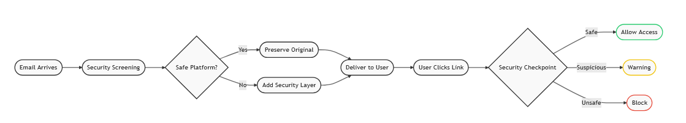
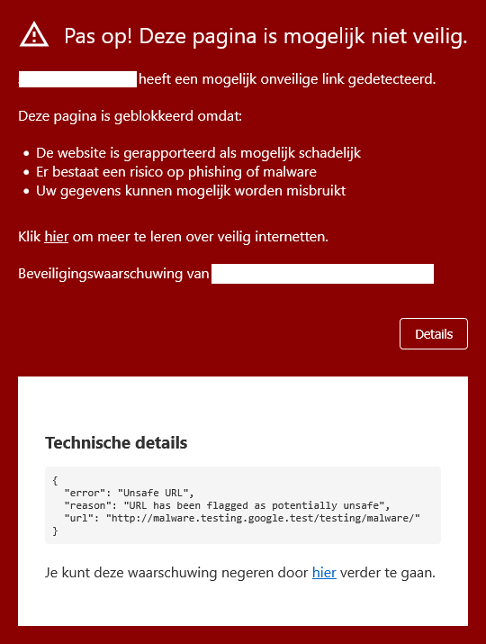
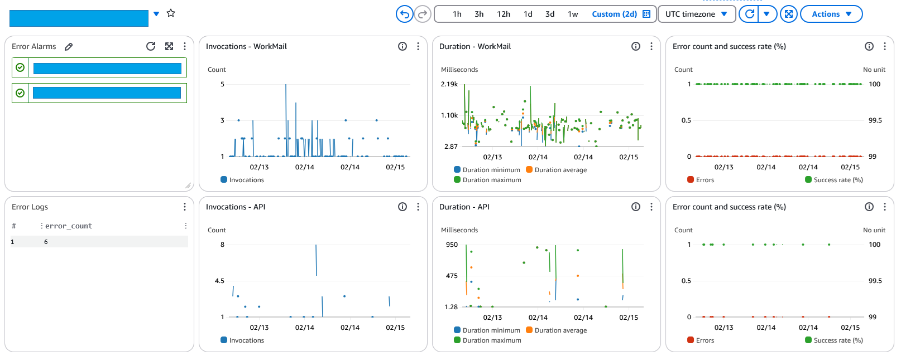
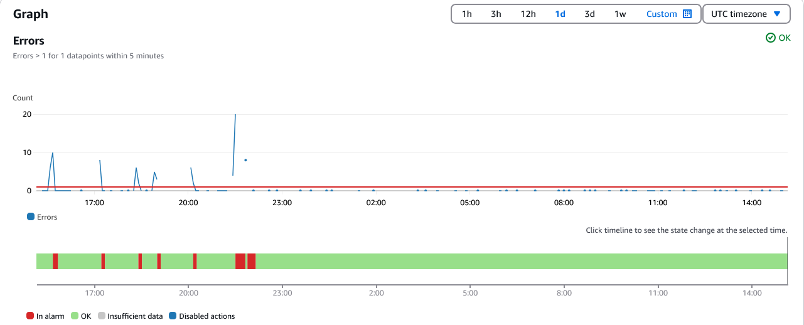
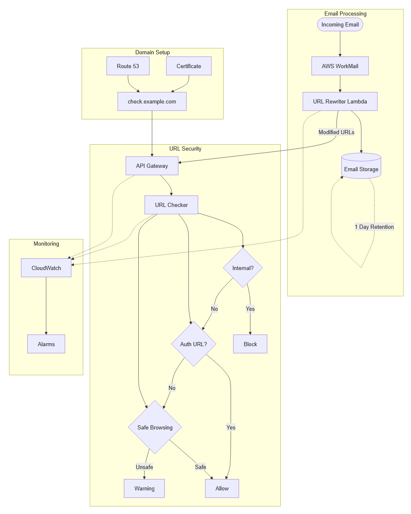

# AI-Learning by Building: Creating an Enterprise-Grade Email Security System for Personal Use

Note: This blog is written for readers without a technical background - every technical term is explained in plain language with Lego analogies in the [Glossary of Terms](#glossary-of-terms). I'd love to hear whether you'd like to see more articles like this one.

## Summary

This blog describes how AI-assisted development helped create an enterprise-grade email protection system for small organizations. 

Like a well-designed Lego structure, the system consists of interconnected components that work together to examine incoming emails and verify web links before they reach users. 

Each piece serves a specific purpose, from initial email processing to Real-time Monitoring, creating a robust environment for the organization's communications.

The solution addresses a common challenge: maintaining consistent protection across different email platforms and devices. Built using Infrastructure as Code and integrated with Amazon WorkMail, it provides capabilities similar to enterprise solutions but at a scale and cost suitable for smaller organizations. The system is designed to protect against current threats while maintaining the flexibility to adapt to new challenges, much like how Lego pieces can be reconfigured to meet new requirements.

Continuous system monitoring (called "Real-time Monitoring" - like having a control panel overlooking our entire Lego city, showing how each part is functioning in the moment) ensures reliable operation, while future developments will leverage AI for enhanced [Threat Detection](#glossary-of-terms) (like having sensors throughout our Lego city that can spot potential problems before they cause harm). This practical example demonstrates how modern development tools and cloud services can help small organizations implement enterprise-grade protection systems.

## Source Code

You can find the code [here](https://github.com/rvaneijk/url-checker-sanitized). This code has been sanitized, meaning all sensitive information like passwords, API keys, and internal system details have been removed and replaced with example values.

## Contents

1.  [From Plumbing to Architecture: AI-Assisted Development](#from-plumbing-to-architecture-ai-assisted-development)
2.  [The Challenge](#the-challenge)
3.  [The Solution: Infrastructure as Code](#the-solution-infrastructure-as-code)
4.  [How Our Security System Clicks into Place](#how-our-security-system-clicks-into-place)
5.  [How Links Are Verified](#how-links-are-verified)
6.  [Performance and Reliability Tracking](#performance-and-reliability-tracking)
7.  [What We Achieved](#what-we-achieved)
8.  [Looking Ahead](#looking-ahead)
9.  [Glossary of Terms](#glossary-of-terms)
10. [Appendix: System Architecture and Features](#appendix-system-architecture-and-features)

## From Plumbing to Architecture: AI-Assisted Development

Occasionally, I am drawn to programming to learn and bring ideas to life. There's no question that software development is transforming, making complex projects more manageable. With the help of AI assistants, routine programming tasks that once consumed hours now take minutes. This lets me focus on what matters most: designing effective solutions to real problems.

Generative AI models like Claude, Gemini, GitHub Copilot, and ChatGPT serve as knowledgeable coding companions in many ways:

1. They help generate boilerplate code
2. They assist with debugging and code robustness
3. They support feature documentation
4. They help implement security best practices

These AI tools streamline the required but often painstaking "plumbing" work of software development and reduce the time needed to make code work effectively.

## The Challenge

This development helped me add a security layer to my email setup. Email security remains challenging, especially when users access messages across different devices and platforms. 

Most organizations share a common problem: employees access email through desktop applications, mobile apps, and web browsers. Each platform offers different security features, making maintaining consistent protection across all access points difficult. While a combination of a modern browser, a virus scanner, and endpoint protection software provides some defense against email threats, the inconsistency across platforms inspired me to develop a centralized security solution that works uniformly for all users.

Before we continue, one important remark: the solution presented in this blog post is just another layer on top of other measures. It complements existing security practices and works alongside them to create a more robust defense strategy rather than replacing current protections.

## The Solution: Infrastructure as Code

The solution I tinkered with integrates directly with the email system - I am using [WorkMail](https://aws.amazon.com/workmail/), Amazon's business email service (similar to Microsoft Exchange or Google Gmail) - to examine messages before they reach users' inboxes. It automatically processes web links (URLs) in emails to ensure they pass through a security checkpoint before reaching their destination.

This functionality is similar to commercial products like [Microsoft Defender for Office 365 Safe Links](https://learn.microsoft.com/en-us/defender-office-365/safe-links-about), [Proofpoint URL Defense](https://www.proofpoint.com/us/resources/data-sheets/essentials-url-defense), and [Mimecast Targeted Threat Protection](https://mimecastsupport.zendesk.com/hc/en-us/articles/34000728653843-Targeted-Threat-Protection-Overview). However, these enterprise solutions are typically designed and priced for large organizations, making them less accessible for a smaller organization or a micro-business. This project demonstrates how similar protection can be implemented for smaller-scale deployments.

The entire solution is built using [Infrastructure as Code (IaC)](#glossary-of-terms), a modern approach where system configurations are defined in code rather than set up manually. It simplifies the deployment of a project in the cloud (in my case, Amazon [AWS](https://aws.amazon.com/cloudformation/)). Like having official Lego instruction manuals that guide perfect assembly every time for the entire system - from security certificates to email processing setup. This approach ensures consistent deployments, tracks all changes, and allows quick recovery if needed. By using IaC, we keep it manageable, even for smaller organizations.

## How Our Security System Clicks into Place

When an email arrives, it goes through an automated security process (a "Lambda Function" - think of it as an automated Lego machine that activates only when needed). It identifies web links within the message while intelligently preserving certain safe links, such as those used for video conferencing platforms. This is like inspecting each Lego brick before clicking the right one into place.

Routing them through a security checkpoint, the system adds a protective layer for other links. When someone clicks a link, the system:
- Examines the link through the security checkpoint
- Directs users to their destination if safe
- Displays warning messages for suspicious content
- Blocks access to known malicious sites

This process happens seamlessly because of how web browsers work, protecting users without disrupting their standard email workflow (Figure 1).

<em>Figure 1. Email Security Flow: This diagram shows how incoming emails are processed. The system checks for web links (URLs) when an email arrives. Each link is then examined for potential security risks. Safe links are allowed through immediately, while suspicious links are flagged for additional verification when clicked. This process happens automatically without disrupting normal email use.</em>

## How Links Are Verified

The security checkpoint (technically called an "[API](#glossary-of-terms)" - think of it as a universal translator that allows different parts of our Lego city to communicate with each other) follows a systematic verification process for each link. It first verifies that the link isn't attempting to access internal systems or networks, preventing potential access to private resources. The system then identifies if the link leads to a, e.g., password-reset page, which receives special handling due to its sensitive nature.

The checkpoint also consults [Google Safe Browsing API](https://safebrowsing.google.com/) to check for known malicious websites. Based on these verifications, the system allows direct access, displays a warning message, or blocks the connection entirely (Figure 2, in Dutch). The user can click the Details button to understand why a URL was flagged or choose to proceed anyway if they trust it.

  

<em>Figure 2. Example of notification (in Dutch) of a blocked URL. The message reads: "Warning! This page might not be safe. We detected a possibly unsafe link. This page is blocked because: (a) the website is reported as potentially malicious, (b) links are screened for phishing or malwar, (c) your data could be misused. Click 'here' to learn more about browsing the web safely," i.e., linking to 'Veilig internetten': https://veiliginternetten.nl/. And in the details panel below the technical details: "You can ignore this warning and continue browsing by following this link."</em>

## Performance and Reliability Tracking

A monitoring system provides continuous oversight of all operations. At the heart of our monitoring are two essential functions: (1) the WorkMail function for processing emails and (2) the API function for security checkpoints. To ensure the system runs smoothly, I've created a comprehensive monitoring dashboard (Figure 3) that displays eight key metrics in real time. These metrics help us maintain optimal performance and quickly identify any potential issues. 

The WorkMail metrics track how effectively emails are being processed, while the API metrics monitor our security checkpoint's performance. Both components are closely monitored for any errors or performance issues, with automated alerts for critical events.

  

<em>Figure 3. System Monitoring D.</em>

The WorkMail metrics track the system's core functionality (Figure 3, widgets on the top row). We can see how many emails are being processed and how quickly they're handled, maintaining a consistently high success rate.

The API metrics monitor our security checkpoint's performance (Figure 3, widgets on the bottom row). This includes tracking how many links are checked and how quickly and reliably these checks are performed.

Both components are closely monitored for any errors or performance issues. The system includes automated alerts for critical events, e.g., rejected messages due to format issues, with visual indicators showing when any component needs attention (Figure 4). This comprehensive monitoring ensures optimal performance while quickly addressing security concerns.

  

<em>Figure 4. Alarm Notification Dashboard.</em>

To further enhance our monitoring capabilities, I use Amazon [X-Ray](https://aws.amazon.com/xray/) to centralize our system's logs directly in the dashboard. This powerful feature helps us connect the dots between any errors that occur and the specific emails that trigger them. For example, suppose our system encounters an unexpected email format or a complex URL structure we hadn't anticipated. In that case, the logs show precisely what happened, when, and which email caused the issue. This detailed insight is invaluable for continuously improving our security rules and handling edge cases we might have initially overlooked.

Think of X-Ray as our Lego assembly camera, capturing every brick's movement from the sorting box to its final position in our creation. While Figures 3 and 4 track our building metrics, the full dashboard with centralized system logs reveals the complete story of each piece in real time.

## What We Achieved

What started as a straightforward security project evolved into a comprehensive protection system for our organization's email (Figure 5 shows the complete system design). 

<em>Figure 5. System Architecture: This diagram shows the email security system's flow, from email receipt to URL protection.</em>

Let's break down how this system works in non-technical terms:

1. Email Receipt: When someone sends an email to your organization, it first arrives at our email server.

2. Security Screening: Before the email reaches anyone's inbox, our system examines it for any web links that might need checking (like a careful inspector checking each brick in a new Lego set).

3. Link Protection: If the system finds any links, it adds a protective layer around them (similar to how specialized Lego pieces might be packaged separately within a set - you can see what they are, but you need to go through an extra step to use them).

4. User Experience: When someone clicks a link in their email:
   - Safe links open immediately in the web browser
   - Suspicious links trigger a warning message, asking the user to double-check before proceeding

5. Continuous Monitoring: The entire process is watched over by our monitoring system, which alerts us if anything needs attention.

## Looking Ahead

Looking ahead, I'm exploring ways to make the system even smarter at detecting deceptive emails, particularly those targeted at specific individuals (known as spear-phishing attacks). First, I'll use a basic system to screen emails for suspicious patterns, and then, for more complex cases, I'll utilize advanced AI to perform detailed analysis of potential threats.

In a more technical description: 
- Step 1: We will start with a smaller [Large Language Model (LLM)](#glossary-of-terms) as our base model, e.g., [BERT base](https://huggingface.co/google-bert/bert-base-uncased), which still fits in our current [IaC](#glossary-of-terms) building block (a [Lambda Function](#glossary-of-terms)).
- Step 2: Progressively train it through multiple phases—first helping it understand email structures, then teaching it to recognize spam, and finally training it to identify nuanced phishing attempts. This approach could help catch more subtle threats Amazon WorkMail's basic spam detection sometimes misses. Although good at classification between benign and malicious emails, it has limited narrative analysis, and lacks complex reasoning capabilities.
- Step 3: Escalating complex cases to a Claude model via Amazon Bedrock for sophisticated threat analysis. The approach could help with a stronger security context understanding and technical analysis.

This gradual improvement approach allows us to enhance security while keeping the system reliable and cost-effective for small organizations. The beauty of our Infrastructure as Code approach means we can easily integrate such improvements while maintaining the system's reliability and maintainability. 

## Glossary of Terms

- **Application Programming Interface (API)**: A standardized way for different computer systems to communicate and share information, acting as a universal translator between different services.

- **CloudWatch**: Amazon's monitoring service that acts like a control room overlooking an entire Lego city, collecting and displaying information about how every part of the city is functioning.

- **Infrastructure as Code (IaC)**: Like having official Lego instruction manuals that not only show how to build the structure but also ensure everyone builds it exactly the same way every time, even when building multiple copies.

- **IAM (Identity and Access Management)**: A framework that controls which users and systems can access specific resources based on their roles and permissions.

- **Lambda Function**: A cloud computing service that runs specific tasks or programs automatically in response to certain events - like automated Lego machines that activate exactly when needed and only use power while working.

- **Large Language Model (LLM)**: An advanced artificial intelligence system trained to understand and process human language,.

- **S3 (Simple Storage Service)**: Amazon's secure digital storage service, like a massive, organized Lego brick storage system where each piece is labeled, protected, and easily retrievable when needed.

- **Stack**: A collection of cloud resources that work together as a single unit, like a complete set of Lego pieces that form a specific structure. For example, our email security system uses several stacks - one for handling the web address, another for checking links, and another for processing emails.

- **Threat Detection**: Automated systems that identify potential security risks.

- **Uniform Resource Locator (URL)**: Web address - the text you type into a web browser to visit a website.

## Appendix: System Architecture and Features

### Overview

This appendix describes how our system protects the organization's communications while ensuring compliance with requirements. Just as a Lego instruction manual guides you through building a complex structure piece by piece, our system is built with different components (which we call "[stacks](#glossary-of-terms)") that connect and work together to create multiple layers of protection. Each [stack](#glossary-of-terms), like a specialized set of Lego bricks, has specific responsibilities that contribute to the overall structure's strength and reliability.

### Core Features

Our infrastructure implements the following measures across all [stacks](#glossary-of-terms):

| Feature | Implementation | Primary Stack |
|---------|----------------|---------------|
| End-to-end Encryption | SSL/TLS certificates and secure channels | Domain Stack |
| Audit Logging | Detailed activity tracking with Amazon CloudWatch](#glossary-of-terms) | API Mapping Stack |
| [Threat Detection](#glossary-of-terms) | Integration with Google Safe Browsing API | API Base Stack |
| Real-time Monitoring | CloudWatch dashboards and alerts | WorkMail Stack |
| Data Retention | Configurable S3 lifecycle policies | WorkMail Stack |
| Access Control | IAM roles and headers | API Base Stack |

### Components and Their Roles

#### 1. Entry Point (Domain Stack)
This component forms the foundation of our structure, like the base plate of a Lego construction. Just as a solid foundation ensures the stability of everything built upon it, this [stack](#stack) provides the secure ground on which all other measures stand. It manages the credentials that verify the system's identity and ensures all communications flow through protected channels.

Key functions:
- Creates a trusted foundation for all operations
- Ensures protected communication pathways
- Maintains system credentials

#### 2. Main Screening (API Base Stack)
Think of this component as the checkpoint in our Lego city. Like specialized Lego pieces that serve specific functions, this [stack](#stack) contains dedicated screening tools. It checks every web link against Google's database of known threats, similar to how a scanner would check visitors entering a Lego city's important buildings.

Key functions:
- Screens links for potential threats
- Controls access to protected areas
- Blocks unauthorized entry
- Maintains screening records

#### 3. Monitoring (API Mapping Stack)
This component acts like the control room of our Lego system, with monitors and recording devices watching over all operations. Just as Lego cities might have cameras and monitoring stations, this [stack](#stack) keeps detailed records of all activities, ensuring nothing goes unnoticed and everything is properly documented for compliance purposes.

Key functions:
- Records all activities
- Creates audit trails
- Enables comprehensive review

#### 4. Email Processing (WorkMail Stack)
Imagine this as the mail sorting facility in our Lego city, where each piece of mail is carefully inspected before delivery. This [stack](#stack) processes all incoming email communications, examining them in a protected environment. Like a sophisticated Lego mail processing center, it handles everything from initial inspection to storage.

Key functions:
- Pre-delivery screening
- Link verification
- Message handling
- Documentation